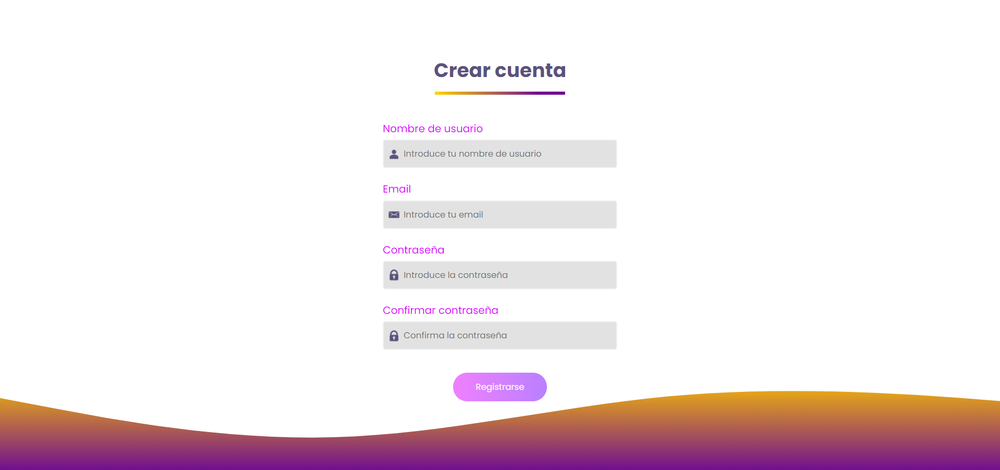

# Formulario Sign Up

## Objetivo:

El ejercicio consiste en desarrollar un formulario de registro con una serie de validaciones. Una vez la usuaria se ha registrado, le aparecerá la intranet con el nombre elegido.

## Tecnologías utilizadas:

- HTML5
- CSS3
- JavaScript

## Demo:

Para ver el resultado de la aplicación puedes visitar el siguiente enlace: https://crisgarm.github.io/sign-up-form/
